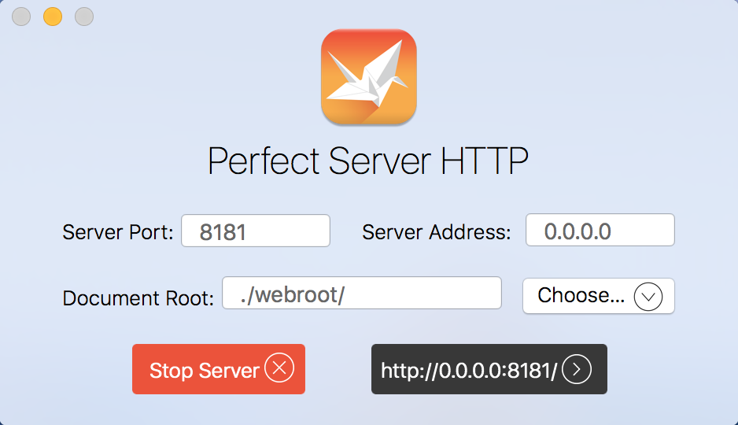

# Perfect Examples

This repository is still in flux as we finalize support for Swift Package manager.
**Download [release-1.0](https://github.com/PerfectlySoft/Perfect/releases/tag/v1.0.0) if you are using Xcode 7.3 with Swift 2.2.**

These examples illustrate how Xcode projects which use Perfect are organized and how the clients and servers are run and debugged. Each example aims to show a different aspect of how Perfect operates with the goal of getting developers up to speed and creating their own server solutions.

* [Getting Started](#getting-started)
* [URL Routing](Sources/URL%20Routing/#url-routing)
* [WebSockets](Sources/WebSockets%20Server/#websockets-server)
* [Tap Tracker](Sources/Tap%20Tracker/#tap-tracker)
* [Upload Enumerator](Sources/Upload%20Enumerator/#upload-enumerator)
* [Authenticator](Sources/Authenticator/#authenticator)

## Getting Started
After cloning the repository or downloading and expanding the zip file, navigate to the Examples directory and open the Examples.xcworkspace file. Each of the example projects consist of a target for an iOS mobile app and a corresponding server module. Each server module is associated with the **Perfect Server HTTP App** permitting it to be launched directly from within Xcode. By default, the server will listen on localhost on port **8181** and each example iOS app will attempt to contact the local server on that port. If you need to change this port, it can be done in the settings for the HTTP App and in the source code for each iOS app.

Perfect Server HTTP Settings:

Example end point in source code:

## Linux Build Notes
First, ensure you have built [PerfectLib](../PerfectLib/#perfectlib) and [Perfect Server](../PerfectServer/#perfectserver).

* cd into the desired example directory
* make
* This will produce a .so library which should be copied or linked into the PerfectLibraries directory in whatever location you are running the Perfect Server from.

## Example Apps
* [URL Routing](Sources/URL%20Routing/#url-routing)
* [WebSockets](Sources/WebSockets%20Server/#websockets-server)
* [Tap Tracker](Sources/Tap%20Tracker/#tap-tracker)
* [Upload Enumerator](Sources/Upload%20Enumerator/#upload-enumerator)
* [Authenticator](Sources/Authenticator/#authenticator)
